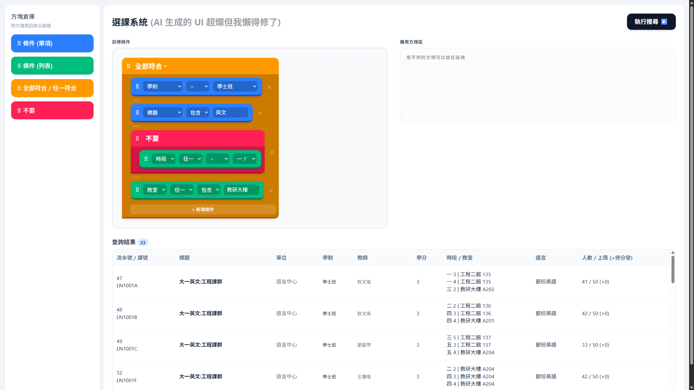

# 中央大學課程樹狀條件查詢系統



原理是我寫了一個系統可以把學校課程資訊全部爬蟲抓下來  
然後整理成一個 SQLite  
然後架一個網頁伺服器可以查詢

查詢的結構是一個 AST，大概像是這樣：

<details>
  <summary>抽象語法樹結構</summary>

  ```js
  {
    and: [
      {
        field: "targetDegree",
        match: {
          op: "eq",
          value: 0
        }
      },
      {
        field: "title",
        match: {
          op: "includes",
          value: "英文"
        }
      },
      {
        not: {
          field: "clocks",
          op: "any",
          each: {
            op: "eq",
            value: "17"
          }
        }
      },
      {
        field: "classrooms",
        op: "any",
        each: {
          op: "includes",
          value: "教研大樓"
        }
      }
    ]
  }
  ```
</details>
<br>

目前把所有課程資訊抓下來大概要 2 ~ 3 分鐘
不過我沒有寫自動執行，所以它不會自動更新

## 使用方法

把左側方塊拉到「目標條件」區，可自由組合  
接著按「執行搜尋」按鈕，結果便會出現在下方 (一次最多出現 500 筆資料)

- 拖曳到已經有方塊的方塊槽會把原本在那的方塊放到備用區
- 拖曳至倉庫可以銷毀方塊
- Ctrl + 點擊可以複製方塊到備用區

## 更新

### v1.1

- 加入了必/選修資訊
- 點擊課號會連結到中央大學選課系統資訊頁

## 未來展望

- 可能做個手機板的